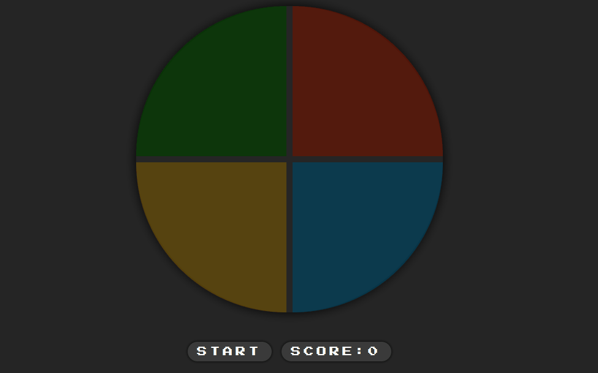

# Genius Game - DIO

Genius-style color memory game.

## 🔎 About the Project

This repository was created in response to the proposed project / challenge within the Digital Innovation One platform.

I made some changes visually and mainly in the way the game works. I put a button so that the user could start the game and also a scoreboard.

### 📌 New Features and Improvements List

- Start button
- Scoreboard
- General game design
- Responsiveness

### 🌐 Link

You can test the game by [clicking here!](https://geniusgame-evemon.netlify.app/)

### 🙇🏻‍♂️ Acknowledgments

I got help to implement some of the features through this [playlist on youtube](https://youtube.com/playlist?list=PL28O_hEAqjAtOPTlRHkHrhfmct_USCGfI) from the Inkasa Dev channel

## 👩🏻 Author

Made with 💜 by Evelyn Monteiro 👋
 

